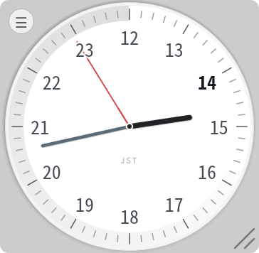

# wall-clock-24h

A frameless, translucent 24-hour wall clock built with PySide6.



## Installation

Install the application with [pipx](https://pipx.pypa.io/) directly from GitHub:

```console
pipx install git+https://github.com/tos-kamiya/wall-clock-24h.git
```

## Usage

Launch the clock with:

```console
wall-clock-24h
```

The window has no frame and uses a translucent background. You can:

- drag the clock with the left mouse button;
- resize it from the bottom-right corner;
- open the hamburger menu in the top-left corner to view the version or quit.

The clock displays the system time zone and highlights the current hour.

## Editions

This repository contains three editions:

- the PySide6 desktop application, installed with `pipx` and launched as `wall-clock-24h`;
- the GNOME Shell desktop widget in [gnome-shell-extension](gnome-shell-extension);
- the standalone browser version in [wall-clock-24h.html](wall-clock-24h.html).

## GNOME widget

The GNOME edition is a Shell extension. It draws the same 24-hour analog clock on the desktop wallpaper (behind windows).

Install it from the `gnome-shell-extension` directory:

```console
./install.sh
gnome-extensions enable wall-clock-24h@tos-kamiya.github.com
```

On Wayland, log out and back in after the first install, then enable the extension.

Once it is running you can:

- drag the clock to move it;
- scroll on the clock to resize it;
- right-click the clock to open the settings.

The panel menu (clock icon in the tray) can:

- toggle whether the clock stays just above the wallpaper or in front of all windows;
- switch the size between S (280px), M (400px), and L (560px).

Use the front layer to move it when Desktop Icons NG is enabled; switch back afterward so it sits on the wallpaper again. You can still scroll on the clock for a custom size.

The extension supports GNOME Shell 45–50.

## License

`wall-clock-24h` is distributed under the terms of the [MIT](https://spdx.org/licenses/MIT.html) license.
